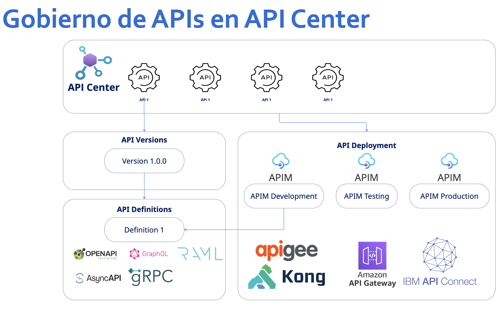

  <h1 style="font-size: 2.8em; margin-bottom: 10px;">🌐 Global Azure 2025 - Perú</h1>
  <h2 style="font-size: 1.6em; font-weight: 400;">
    Gobierna tus APIs con Azure API Management y API Center
  </h2>

  📂 Puedes descargar la presentacion:
  <a href="/docs/ppts/GobiernodeAPIsconAzureAPIManagementyAPICenter.pptx" target="_blank" style="
    display: inline-block;
    margin-left: 10px;
    padding: 10px 20px;
    background-color: #0078D4;
    color: white;
    text-decoration: none;
    border-radius: 6px;
    font-weight: bold;
  ">Descargar</a>

   

  

  

    En esta sesión introductoria al <strong>gobierno de APIs con Azure API Management</strong> y el reciente servicio de <strong>Azure API Center</strong>, exploraremos cómo estos servicios permiten gobernar nuestras APIs en la organización desde el aspecto tecnológico.
  

  

    Para ello, es primordial contar con una <em>Estrategia de APIficación</em>, un <em>Modelo Operativo de Gobierno</em>, <em>Estándares y Lineamientos</em> sobre las APIs y, finalmente, la <em>Plataforma Tecnológica</em> donde estarán nuestras APIs.
  

  <h2 style="color: #0078D4; margin-top: 40px;">📘 Recursos recomendados</h2>

  <table style="
    width: 100%;
    border-collapse: collapse;
    margin-top: 20px;
    background-color: white;
    border: 1px solid #ddd;
    border-radius: 8px;
    overflow: hidden;
  ">
    <thead style="background-color: #e5f1fb;">
      <tr>
        <th style="padding: 12px 16px; text-align: left;">Recurso</th>
        <th style="padding: 12px 16px; text-align: left;">Enlace</th>
      </tr>
    </thead>
    <tbody>
      <tr>
        <td style="padding: 12px 16px; border-top: 1px solid #eee;">Azure Labs API Center</td>
        <td style="padding: 12px 16px; border-top: 1px solid #eee;">
          <a href="https://github.com/Azure-Samples/universal-api-center" target="_blank" style="color: #0078D4; text-decoration: none;">Azure Labs API Center</a>
        </td>
      </tr>
      <tr style="background-color: #f9f9f9;">
        <td style="padding: 12px 16px; border-top: 1px solid #eee;">Azure API Management Workshop</td>
        <td style="padding: 12px 16px; border-top: 1px solid #eee;">
          <a href="https://azure.github.io/apim-lab/" target="_blank" style="color: #0078D4; text-decoration: none;">Azure API Management Workshop</a>
        </td>
      </tr>
      <tr style="background-color: #f9f9f9;">
        <td style="padding: 12px 16px; border-top: 1px solid #eee;"> MS Learn - Introduction to Azure API Center</td>
        <td style="padding: 12px 16px; border-top: 1px solid #eee;">
          <a href="https://learn.microsoft.com/en-gb/training/modules/introduction-to-azure-api-center/" target="_blank" style="color: #0078D4; text-decoration: none;">Azure API Center Training</a>
        </td>
      </tr>
      <tr style="background-color: #f9f9f9;">
        <td style="padding: 12px 16px; border-top: 1px solid #eee;"> MS Learn - Architect API integration in Azure</td>
        <td style="padding: 12px 16px; border-top: 1px solid #eee;">
          <a href="https://learn.microsoft.com/en-gb/training/modules/introduction-to-azure-api-center/" target="_blank" style="color: #0078D4; text-decoration: none;">Architect API integration in Azure</a>
        </td>
      </tr>
    </tbody>
  </table>

  <blockquote style="
    margin-top: 40px;
    padding: 20px;
    background-color: #e8f1fb;
    border-left: 5px solid #0078D4;
    border-radius: 8px;
    color: #1b1b1b;
  ">
    <strong>🔔 Nota Importante:</strong> 
    Si estás interesado en poder conversar sobre APIs y API Management, puedes contactarme y podemos explorar los desafíos sobre esta plataforma y su evolución.
  </blockquote>
  

  

    🙏 <strong>Muchas gracias a la comunidad de Microsoft User Group Perú</strong> por brindarme este espacio y la oportunidad de compartir mi experiencia profesional mediante esta sesión.
  

